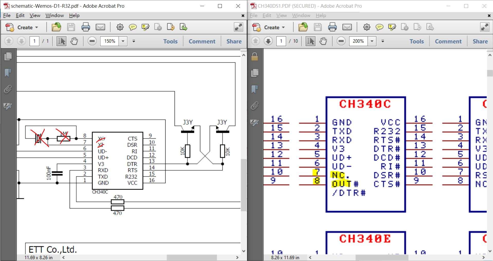
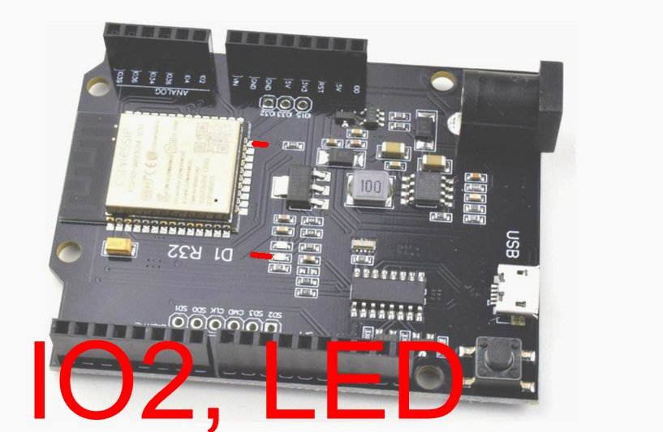
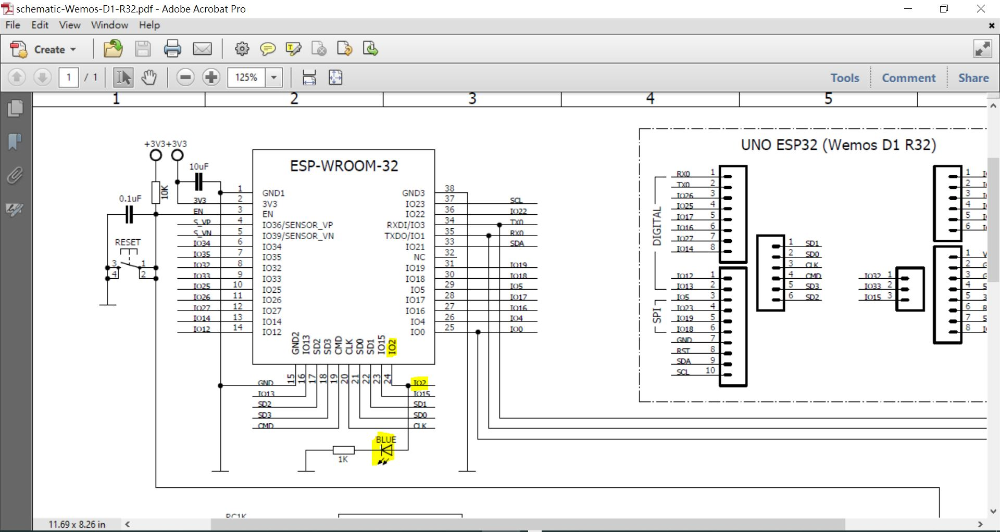
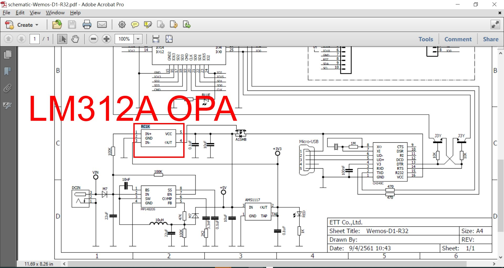
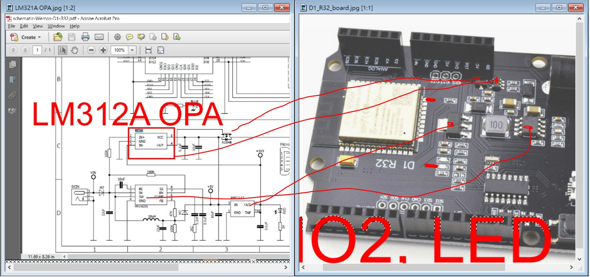

# ESP32_WeMos_D1_R32_IO2_Blink
testing done. ESP32 D1_R32 board or clone, UNO size PCB, ESP32 module, LED is pin IO2

### ESP32 metal can module datasheet
ref : [esp32-wroom-32d_esp32-wroom-32u_datasheet_en.pdf](esp32-wroom-32d_esp32-wroom-32u_datasheet_en.pdf)  

### schematic
a copy here, http://kio4.com/arduino/imagenes/sch-Wemos-D1-R32.pdf  
local cached [schematic-Wemos-D1-R32.pdf](schematic-Wemos-D1-R32.pdf)  

### error of the schematic  
it has been proven the schematic has no 100% correction, the CH340C pin 7 & pin 8 are not used, and the chip is not required XTAL.  
the borad has no such components as well.  
  
datasheet [CH340DS1.PDF](CH340DS1.PDF)  

### board, Arduino UNO form factor
IO2 and LED,  
  

  

### LM321, OPA
  
  
datasheet [lmv321a_OPA.pdf](lmv321a_OPA.pdf)  

### firmware and burn script for quick testing
change com#, then run the burn.bat

```
cls
prompt $xiao

set 

set comport=COM7
```
