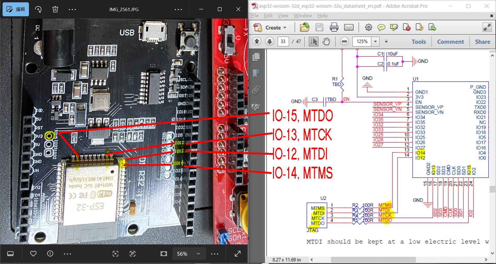
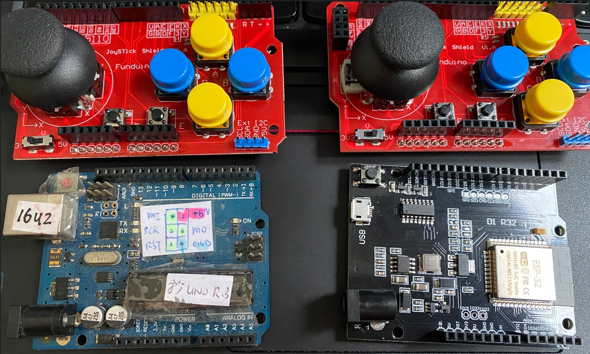
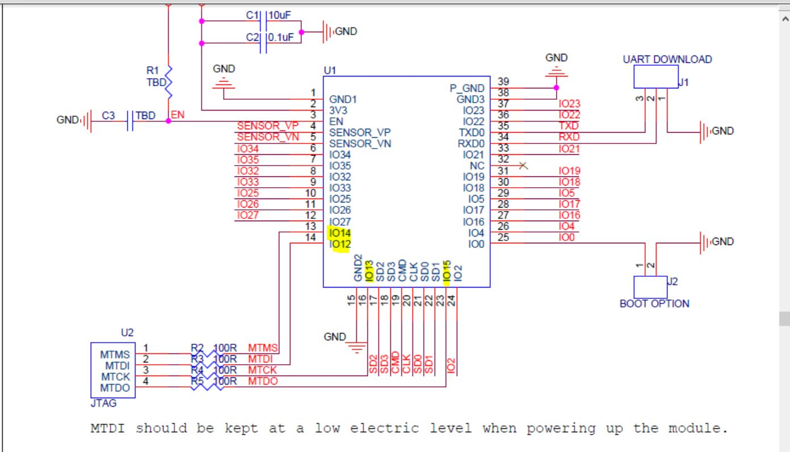
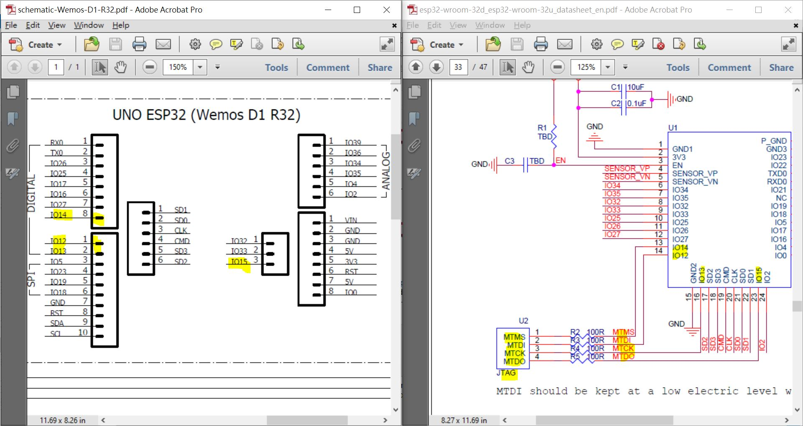
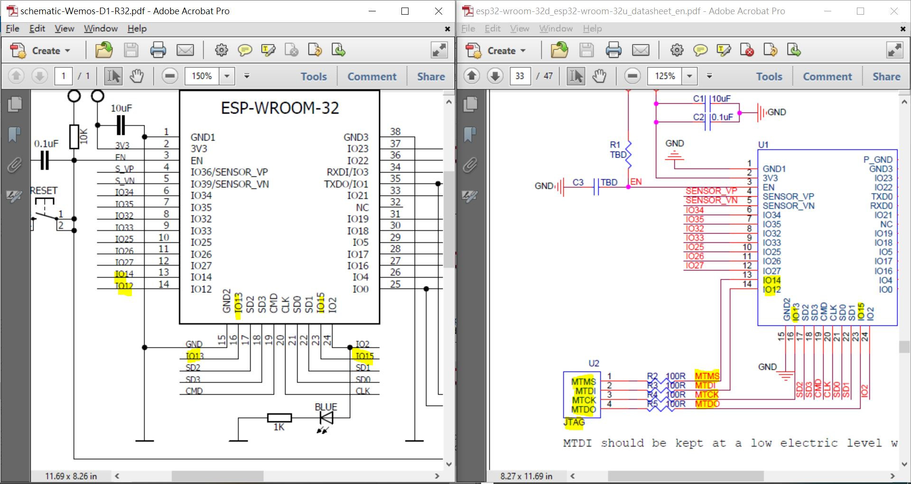

# ESP32_WeMos_D1_R32_IO2_Blink
testing done. ESP32 D1_R32 board or clone, UNO size PCB, ESP32 module, LED is pin IO2

### ESP32 metal can module datasheet
ref : [esp32-wroom-32d_esp32-wroom-32u_datasheet_en.pdf](esp32-wroom-32d_esp32-wroom-32u_datasheet_en.pdf)  

### schematic
a copy here, http://kio4.com/arduino/imagenes/sch-Wemos-D1-R32.pdf  
local cached [schematic-Wemos-D1-R32.pdf](schematic-Wemos-D1-R32.pdf)  

### error of the schematic  
it has been proven the schematic has no 100% correction, the CH340C pin 7 & pin 8 are not used, and the chip is not required XTAL.  
the borad has no such components as well.  
  
datasheet [CH340DS1.PDF](CH340DS1.PDF)  

### board, Arduino UNO form factor
IO2 and LED,  
  

  

### LM321, OPA
  
  
datasheet [lmv321a_OPA.pdf](lmv321a_OPA.pdf)  

### firmware and burn script for quick testing
change com#, then run the burn.bat

```
cls
prompt $xiao

set 

set comport=COM7
```


### JTAG pin header is missing
```
驗證兩版版, 找出主要瑕疵.
紅版 PITCH 不匹配, ROW - ROW 相差0.6mm, 需要強行插入板板
紅版 按鈕力度過高, 不好使
紅版 右下角 I2O 印字已經更正為 I2C
黑版 EMI 過不了, 玩家市場不介意也不懂得介意即可
黑版 IO 印字不清晰, 方向各異
黑版 USB 小口外殼每接地, 無通孔爪版, 要改善
黑版 只有 RESET 按鈕, 無印字
黑版 無 BOOT 按鈕
黑版 紅燈IO-2, 藍燈3V3, 互換了位置, 不影響使用, 缺少印字
黑版 無單獨 JTAG / ISP 針腳 (IO-12/13/14/15)
黑版 CPU : ESP32-D0WD-V3 (revision v3.1) 已升級 QFN5x5
https://documentation.espressif.com/esp32_datasheet_en.pdf
黑版 外接 SPI Flash Memory Information:
=========================
Manufacturer: 68, Cypress Semiconductor (formerly Spansion)
Device: 4016
Detected flash size: 4MB
Flash voltage set by a strapping pin: 3.3V
Interface: Likely SPI (Serial Peripheral Interface)
Type: NOR flash memory
```
[JTAG_pins/esp32_datasheet_en.pdf](JTAG_pins/esp32_datasheet_en.pdf)
[JTAG_pins/device_info.txt](JTAG_pins/device_info.txt)


  





